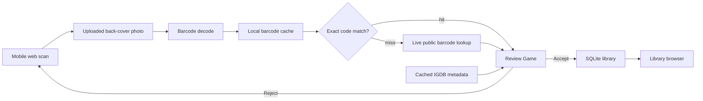

# Architecture

## Goal

The app manages a physical video game collection from a mobile-friendly local web UI.

Current scope:

- scan one back-cover barcode photo at a time,
- resolve the barcode through local cache and live public lookup sources,
- show provider box art for visual confirmation,
- import only user-accepted matches,
- track collection state and played state,
- preserve play history after a game is sold,
- keep all personal data out of the public repo.

## Web Pipeline



The web server stores uploaded images, audit rows, and caches under ignored local paths so the browser workflow can resume and display review state.

## Data Model

`games` stores provider identity and metadata:

- title,
- platform,
- release date,
- description,
- cover URL,
- raw metadata JSON.

`collection_items` stores one collection state per owned library item:

- `owned`,
- `would_sell`,
- `sold`,
- `loaned`,
- `wishlist`.

`playthroughs` stores play state history:

- `unplayed`,
- `playing`,
- `completed`,
- `retired`.

`collection_summary` combines game metadata, collection state, and latest play state for the library UI.

The schema intentionally does not include free-text condition/location/sale notes, sold price/date fields, separate play session notes, planning tables, or tag tables because those are not part of the current web app design.

## Matching Strategy

Ingest is barcode-only. Cover art is never used as an image matching source.

The scanner decodes and validates retail packaging codes:

- GTIN-12 / UPC-A for many North American releases,
- GTIN-13 / EAN/JAN for international and Japanese releases,
- GTIN-8 / UPC-E for compact labels,
- GTIN-14 when a data source stores padded GTINs.

Platform hints rank and validate likely barcode formats, but do not create an identity match by themselves. Import identity requires a resolved barcode row or a user-selected title/platform in review.

## Caches

The `Cache` page manages local data used by the web UI:

- IGDB platform list,
- title autocomplete indexes,
- cover art for visual confirmation,
- barcode source downloads,
- local barcode cache rebuilds,
- missing cover art refresh for library games.

Local ignored paths:

```text
review/web-ingests/
review/barcode-sources/
review/barcodes/
review/cache/
```

These files can contain uploaded photos, private library evidence, and derived cache data, so they should not be committed.
