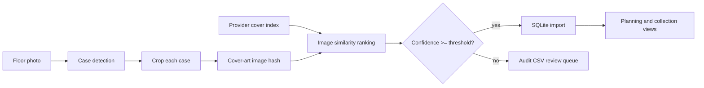

# Architecture

## Goals

The system should inventory physical games from wide photos while keeping a trustworthy local history of ownership and play status.

Core requirements:

- Add games from a floor-layout photo.
- Use an external metadata/artwork provider where possible.
- Plan what to play next from owned/unplayed games.
- Track completed games independently of ownership.
- Mark games as candidates for sale.
- Mark games as sold without losing play history.

## Pipeline



## Data Model

`games` stores provider-backed identity and metadata. A game can exist even when you no longer own a copy.

`collection_items` stores ownership state for a physical copy:

- `owned`
- `would_sell`
- `sold`
- `loaned`
- `wishlist`

`playthroughs` stores durable history:

- `unplayed`
- `playing`
- `completed`
- `retired`

This is the key design choice: selling a copy updates `collection_items`, but completed history remains in `playthroughs`.

## Provider Strategy

The metadata provider boundary returns a normalized `GameMatch` with title, platform, dates, cover URL, and raw provider payload.

Start with:

- TheGamesDB for community game/artwork data.
- IGDB for richer metadata and cover art using Twitch client-credentials auth.

Add later:

- RAWG as a broad fallback source if its attribution terms fit the UI.
- Local LaunchBox export/import if you already maintain a LaunchBox library.

## Recognition Strategy

The photo recognizer should be optimized for accuracy over magic:

1. Ask the user to photograph cases in a grid with minimal overlap.
2. Detect rectangular case boundaries using OpenCV contours.
3. Save numbered crops.
4. Compute an image hash for each crop.
5. Compare the crop hash to an indexed set of provider cover-art hashes.
6. Auto-accept only high-confidence matches.
7. Send ambiguous results to CSV review.

## Automated Ingest

Photo ingest depends on the image-processing stack installed by the base project package:

```toml
dependencies = [
    "numpy",
    "opencv-python",
    "pillow",
]
```

The primary command is:

```bash
game-collection ingest-photos photos/incoming/ --provider igdb --platform "PlayStation 5"
```

It builds or reuses an IGDB cover-art index for the selected platform, then writes:

- `review/photo-candidates.csv` for detected cover candidates,
- `review/photo-ingest.audit.csv` for match/import decisions,
- `review/crops/` for detected case crops.

High-confidence rows are imported automatically. Low-confidence rows stay in the audit CSV for later cleanup.

Prioritized platform indexes:

- `PlayStation 5`
- `PlayStation 4`
- `Xbox One`
- `Xbox Series X|S`

The web server starts prebuilding those four cover indexes in the background by default and caches the full IGDB platform list for the upload picklist. Matching should use local cached cover hashes during upload, not build platform indexes on demand.

The `Cache Settings` web view lists all cached IGDB platforms first, then all uncached IGDB platforms alphabetically. Submitting checked platforms builds local cover-art indexes for them.
