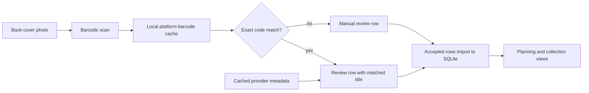

# Architecture

## Goals

The system should inventory physical games from wide photos while keeping a trustworthy local history of ownership and play status.

Core requirements:

- Add games from a floor-layout photo.
- Use an external metadata/artwork provider where possible.
- Plan what to play next from owned/unplayed games.
- Track completed games independently of ownership.
- Mark games as candidates for sale.
- Mark games as sold without losing play history.

## Pipeline



## Data Model

`games` stores provider-backed identity and metadata. A game can exist even when you no longer own a copy.

`collection_items` stores ownership state for a physical copy:

- `owned`
- `would_sell`
- `sold`
- `loaned`
- `wishlist`

`playthroughs` stores durable history:

- `unplayed`
- `playing`
- `completed`
- `retired`

This is the key design choice: selling a copy updates `collection_items`, but completed history remains in `playthroughs`.

## Provider Strategy

The metadata provider boundary returns a normalized `GameMatch` with title, platform, dates, cover URL, and raw provider payload.

Start with:

- TheGamesDB for community game/artwork data.
- IGDB for richer metadata and cover art using Twitch client-credentials auth.

Add later:

- RAWG as a broad fallback source if its attribution terms fit the UI.
- Local LaunchBox export/import if you already maintain a LaunchBox library.

## Recognition Strategy

The photo recognizer should be optimized for accuracy over magic:

1. Ask the user to photograph the backs of cases so barcodes are visible.
2. Decode UPC/EAN barcodes from uploaded photos.
3. Validate decoded values as GS1 GTIN-8/12/13/14 codes.
4. Use the platform hint to prioritize expected publisher/manufacturer prefixes.
5. Match decoded codes against the local platform barcode cache.
6. Enrich matched titles from cached provider metadata when available.
7. Add unmatched or missing expected titles as manual review rows.
8. Import only rows explicitly accepted in review.

## Automated Ingest

Photo ingest depends on the image-processing stack installed by the base project package:

```toml
dependencies = [
    "numpy",
    "opencv-python",
]
```

The primary command is:

```bash
game-collection ingest-photos photos/incoming/ --provider igdb --platform "PlayStation 5"
```

It scans photos for barcodes, then writes:

- `review/photo-candidates.csv` for barcode-derived candidates,
- `review/photo-ingest.audit.csv` for match/import decisions,
- `review/crops/` as a compatibility output directory.

Rows are not imported automatically from photo upload. Accepted rows are imported after browser review.

Prioritized platform indexes:

- `PlayStation 5`
- `PlayStation 4`
- `Xbox One`
- `Xbox Series X|S`

The web server starts prebuilding those four metadata indexes in the background by default and caches the full IGDB platform list for the upload picklist. Barcode matching uses local CSV caches under `review/barcodes/`; cached provider metadata is used for autocomplete and cover art display.

Barcode caches are built from CSV sources:

```bash
game-collection build-barcode-cache --source examples/barcode-catalog.example.csv
```

The builder accepts local CSV files, folders of CSV files, and CSV URLs. It recognizes the project schema plus common export column names such as `upc`, `ean`, `gtin`, `product-name`, and `console-name`, so a broad source export can populate caches for every platform present in that export.

No-subscription source connectors normalize public data into the same CSV schema:

- `wikidata-video-games`: SPARQL query for video game items with GTIN values.
- `upcdev-search`: public text search against upc.dev.
- `upcdev-product`: public lookup for known GTIN values through upc.dev.
- `open-products-facts`: public lookup for known GTIN values through Open Products Facts.

These connectors do not guarantee complete coverage. They are cache seeders for sources that expose data without paid access; exact ingest still depends on the barcode being present in the local cache.

The same source downloads are available from the `Cache Settings` web page. Downloaded source CSVs are stored under ignored local paths in `review/barcode-sources/`, then `review/barcodes/` is rebuilt from those source files. Source downloads support incremental merge behavior; Wikidata also accepts limit/offset paging.

The scanner anticipates standard retail game packaging codes:

- GTIN-12 / UPC-A for North American releases.
- GTIN-13 / EAN/JAN for international and Japanese releases.
- GTIN-8 / UPC-E for compact labels.
- GTIN-14 as a fallback for data sources that store zero-padded GTINs.

Platform hints do not make a match by themselves. They validate and rank decoded codes using common prefixes such as Nintendo `045496`/`4902370`, PlayStation `711719`/`4948872`, Xbox `885370`/`889842`, Sega `010086`/`4974365`, Capcom `013388`, Electronic Arts `014633`, Activision `047875`, Ubisoft `008888`, Square Enix `662248`, Take-Two `710425`, Warner `883929`, and Limited Run `812303`; import identity still requires an exact cached barcode row.

The `Cache Settings` web view lists all cached IGDB platforms first, then all uncached IGDB platforms alphabetically. Submitting checked platforms builds local metadata indexes for them.
